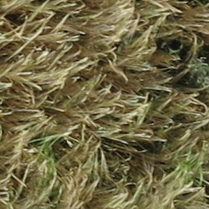
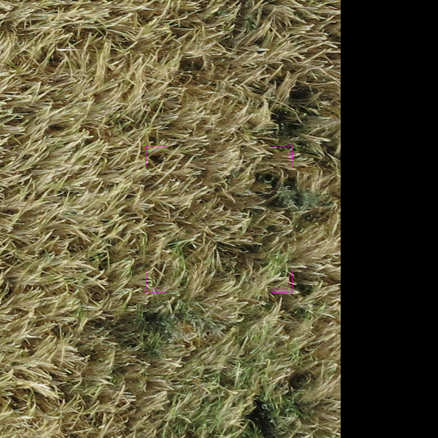

Weed Recognization
==================

This is the free topic for 2017-2018 block 1.

-----

Database description
--------------------

The database include two kinds of crops,barley and wheat.For each group,we got theimages from 5 attitutes,10m,20m,30,50m.   

 


For each image, we divide it to several small pictures.Then we identify these pictures as weed one or crop one mamully.Atfer we extend the pictures to one surround picture for training.   



Before start
------------

### python for Linux

There are some problems with python in Linux environment. So please remember to set virtual environment or virtual machine in Linux.I use [virtualenv](https://virtualenv.pypa.io/en/stable/)
```shell
virtualenv env
source env/bin/activate
```
For preprocess our images, I choose [OpenCV](http://opencv.org/)


### [CNN](http://www.pyimagesearch.com/2016/08/01/lenet-convolutional-neural-network-in-python/)
CNN is so hot now.It made something easier.Instead of old school image processing method,cnn seems a better for us to do area recognition.

Preprocess for images
---------------------

- Color normalization
- Images normalization
- Remove the edge with value 0

### Color normalization

Since our pictures are taken from different weather and different angle. So the light may have some influence in the CNN training. It will smart to preprocess pictures before the training, 

### Image normalization

Make all images including traing set and testing set be in the same scale

### Remove the edges with value 0

It is necessary to remove these small parts. I think the pixel with value 0 may have bad influence on classifier training. If we remove the pixels which are 0, the accurance will increase. Not sure now. Will experiment!!!


